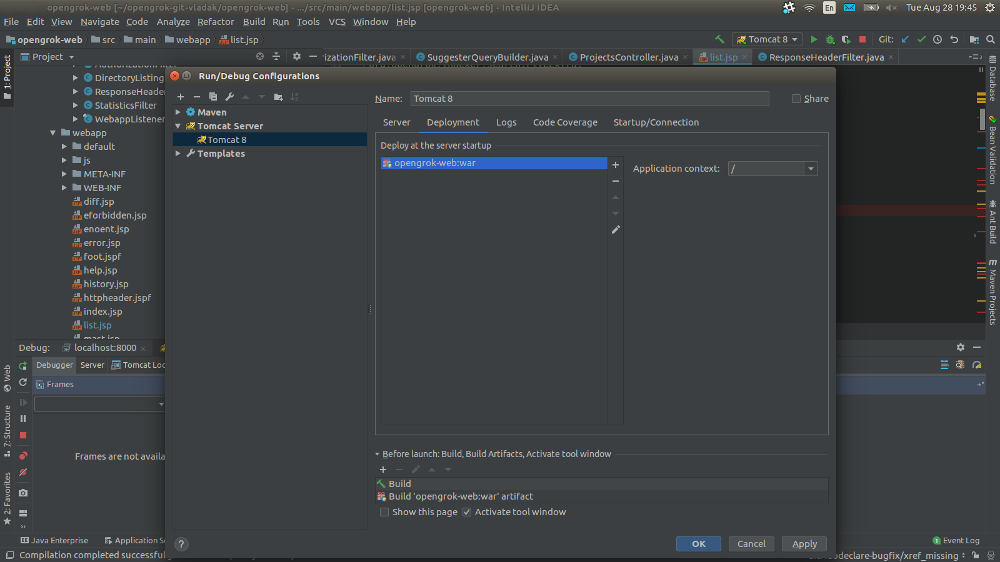

## Attaching a debugger

### Indexer

When running the indexer, add the following Java options:

```
-agentlib:jdwp=transport=dt_socket,server=y,address=8010,suspend=y
```

This will make the indexer to listen on the port 8010 until a debugger connects.

In Netbeans, select the Debug -> Attach Debugger from the menu and fill in the port number in the dialog window and click Attach.

Then simply insert a breakpoint either in the Indexer code.

### Web application

In IDEA, in order to debug JSPs, you need the IDEA Ultimate edition. In Netbeans it should work out of the box. We will describe how to debug in IDEA here.

First, open the `opengrok-web` Maven project.

Start by going to the 'Run' menu, select 'Edit Configurations' and create one based on Tomcat server (local) template:

[](images/IDEA-Tomcat_server.png)

then go to the 'Deployments' tab and select add the opengrok-web.war Artifact:

[](images/IDEA-Tomcat_deployment.png)

Then it is possible to start Tomcat via IDEA in debug mode by clicking on the small green bug icon (in the left bottom corner):

[](images/IDEA-Tomcat_start_debug.png)

Once the server is up, IDEA will deploy the web application and open a browser window. It should be possible to insert breakpoints into JSPs:

[](images/IDEA_JSP_breakpoint.png)

The active breakpoints are marked by a little tickmark.

#### Supply debug options to Tomcat directly

Alternatively, to debug the web application the most generic way would be to add debug parameters to the application server. However, I could not get the following to work:

For Tomcat, create the `bin/setenv.sh` file with the following contents:

```shell
CATALINA_OPTS="-agentlib:jdwp=transport=dt_socket,address=8000,server=y,suspend=n"
```

Then restart Tomcat and then you can simply use remote debugging from your IDE, i.e. in IDEA in the 'Run' menu, select 'Attach to Process' and IDEA will offer process selection automatically:

[](images/IDEA_ultimate-debug_web.png)

In order to descend into source code not present in the `opengrok-web` module, it is necessary to tell IDEA where the sources live, otherwise it will show decompiled source (click on the top bar displayed when going through decompiled sources).

## Profiling

For profiling an indexing run, JWDP is not required for a local `ProcessAttach`. It is convenient though to pause the run until the profiler is attached.

### Example in NetBeans

1. Start an indexing run in a terminal for profiling:
```
$ OPENGROK_PROFILER=1 OpenGrok index --profiler
Loading the default instance configuration ...
Start profiler. Continue (Y/N)? 
```

2. Attach the NetBeans profiler from the menu: Profile -> Attach to External Process ... -> ... Already running local Java process.
3. Continue the indexing run in the terminal by entering `Y`.
4. After the run, NetBeans will present the analysis.