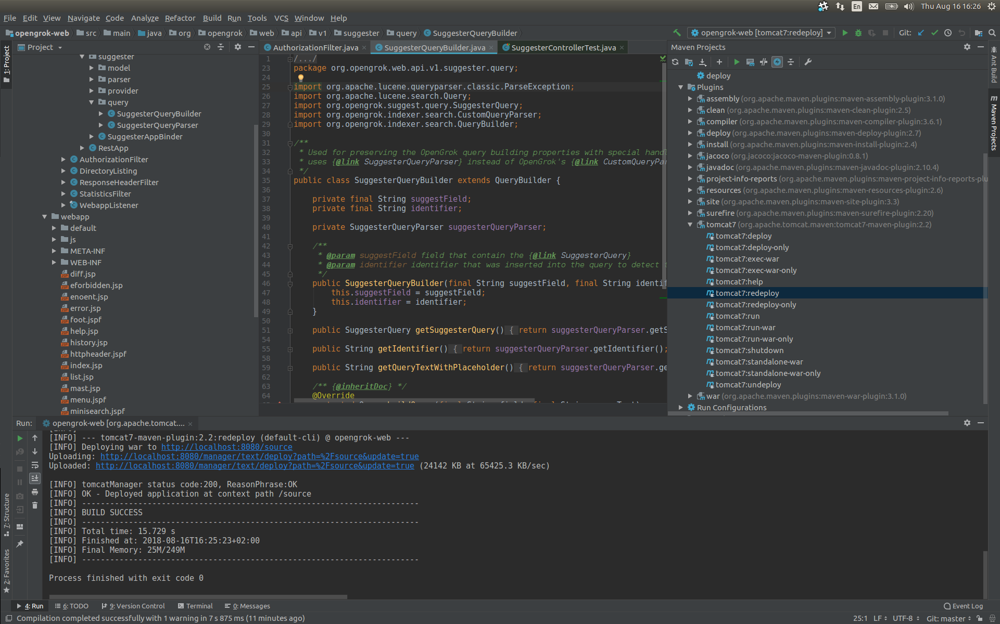
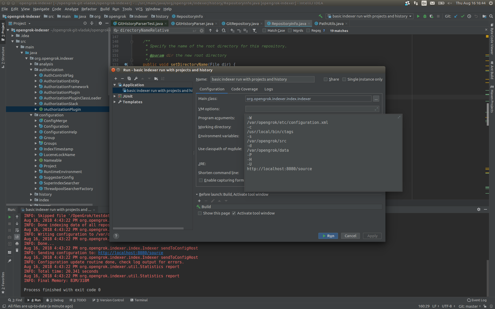
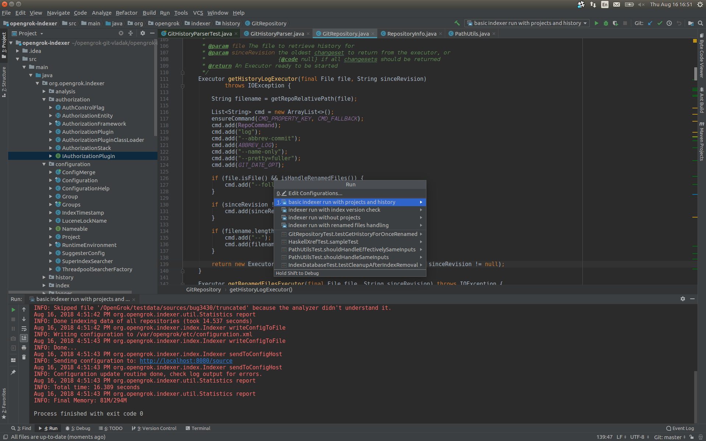

If you wanted to make a change to OpenGrok code base (small fix, new feature, [anything](https://github.com/opengrok/opengrok/issues?q=is%3Aopen+is%3Aissue+label%3A%22help+wanted%22)) here's couple of steps to get you started.

### Before we begin

Firstly, create Github account (of course !).

OpenGrok can be built and tested on any system with Java. You will need:

1. At least JDK8
1. [Universal ctags](https://github.com/universal-ctags) (built from source)
1. Git (for cloning the repository)
1. Subversion (needed for successful build)
1. Any modern IDE (e.g. [IDEA](https://www.jetbrains.com/idea/), [Eclipse](http://www.eclipse.org/downloads/packages/))
1. Python 3.x (for OpenGrok tools)
1. other SCMs 

Also, it would not hurt if you created an issue (https://github.com/oracle/OpenGrok/issues) and mentioned that you will be working on it.

### Setting up your code repository

You'll want to create a fork of the oracle/OpenGrok repo. On Github this is as simple as clicking '**Fork**' on the main project page. Getting the source code of your fork is easy, just use the instructions on the front page of the project and select the right method for you for getting the source (https://help.github.com/articles/which-remote-url-should-i-use).

Here's an example on getting the source from command line (assuming your fork is called 'foo/OpenGrok' (where 'foo' is your username on Github)

```
git clone git@github.com:foo/OpenGrok.git opengrok-git-mine
```

You'll want to setup remotes (mainly the path to the upstream repo) using the steps on https://help.github.com/articles/fork-a-repo For OpenGrok it would be:

```
cd opengrok-git-mine
git remote add upstream git@github.com:oracle/OpenGrok.git
```

Then create a branch (again, the help document on https://help.github.com/articles/fork-a-repo contains detailed steps) and switch to it, e.g.:

```
git branch myfix
git checkout myfix
```

### Building

To build the code from command line, just run `./mvnw compile`. It will download all necessary pre-requisities. When using IDE you can open or import the project.

### Deploy the web app to the web server

There are two possibilities - either copy the `source.war` directly or use Maven Tomcat plugin that will upload it. The net effect will be the same.

Firstly, start your application server. E.g. for Tomcat that could look something like this (depending on where you extracted Tomcat):
```shell
$ ~/apache-tomcat-8.0.27/bin/startup.sh 
Using CATALINA_BASE:   /home/vkotal/apache-tomcat-8.0.27
Using CATALINA_HOME:   /home/vkotal/apache-tomcat-8.0.27
Using CATALINA_TMPDIR: /home/vkotal/apache-tomcat-8.0.27/temp
Using JRE_HOME:        /usr/lib/jvm/java-8-oracle
Using CLASSPATH:       /home/vkotal/apache-tomcat-8.0.27/bin/bootstrap.jar:/home/vkotal/apache-tomcat-8.0.27/bin/tomcat-juli.jar
Tomcat started.
```

#### a) Deploy `.war` directly

Run command `./mvnw package -DskipTests` which will create a release as in the [releases page](https://github.com/oracle/opengrok/releases). This release can be found in the `distribution/target` directory with file name `opengrok-{version}.tar.gz`. Unzip the file by `tar xvf opengrok-{version}.tar.gz`. The `.war` file is located in `opengrok-{version}/lib/source.war`. You can copy this file to the web applications directory of your application server (e.g. `webapps` for Tomcat). Or you can use different means specific to application servers (e.g. Tomcat Manager).

#### b) Use Maven Tomcat plugin

Modify Maven configuration (`~/.m2/settings.xml`) so that it contains:
```xml
<settings>
  <servers>
    <server>
      <id>OpenGrok</id>
      <username>admin1</username> <!-- you can use different name -->
      <password>admin1</password> <!-- you can use different password -->
    </server>
  </servers>
</settings>
```

Add this to the `tomcat_users.xml` file located in the `conf/` directory of your Tomcat server:
```xml
<username="admin1" user password="admin1" roles="tomcat,manager-script"/>
```

**Note:** Do not add `manager-gui` role because it won't work.

Build the artifacts from the top directory of the project:
```bash
./mvnw install
```

If the web application has not been deployed before, deploy it:
```bash
cd opengrok-web && ../mvnw -DskipTests=true tomcat7:deploy
```
otherwise redeploy it:
```bash
cd opengrok-web && ../mvnw -DskipTests=true tomcat7:redeploy
```

Or invoke the Maven target via an IDE - e.g. in IDEA simply click on the Maven projects tab on the upper right side of the window. Then invoke the redeploy target of the Maven Tomcat plugin. It is advisable to toggle the 'Skip tests' button in order to speed up the redeploy.

[](images/IDEA-tomcat_redeploy.png)

### Setup sources and index them

Now setup the sources to be indexed under e.g. `/var/opengrok/src` and create data directory for storing indexes under e.g. `/var/opengrok/data`. Make sure both directories have correct permissions so that the user running the process can read and write to them.

In IDEA, go to the _Run_ menu and select _Edit Configurations_ and create a configuration based on _Application_ so it looks e.g. like this:

[](images/IDEA-basic_indexer_run.png)

The arguments are nicely editable by expanding the field:

[](images/IDEA-simple_indexer_run_example.png)

You can then run the indexer from the _Run_ item in the _Run_ menu. Of course, there can be multiple indexer runs preconfigured.

[](images/IDEA-multiple_run_profiles.png)

Or, you can run the main method `org.opengrok.indexer.index.Indexer` e.g. like this from command line (once the Maven `package` phase is done):
```
java -Djava.util.logging.config.file=logging.properties \
    -cp 'distribution/target/dist/*' org.opengrok.indexer.index.Indexer \
    -W /var/opengrok/etc/configuration.xml \
    -s /var/opengrok/src \
    -d /var/opengrok/data \
    -c /usr/local/bin/ctags \
    -H -S -P \
    -U http://localhost:8080/source
```

This is assuming the `ctags` binary of your ctags installation resides in `/usr/local/bin/ctags`.

If you now refresh the web page mentioned above it will reflect the reindex and you can do searches etc.

### Debugging

See [[Debugging wiki|Debugging]] for more information on debugging.

### Testing

To run tests type `./mvnw test` command. For specific tests you can use `-Dtest` option, e.g. `./mvnw test -Dtest=IndexerTest -DfailIfNoTests=false`.

Note that the tests need some pre-requisites to run, namely Universal ctags and also some SCMs (at least Mercurial and Git are recommended). The JUnit tests are made so that if some pre-requisites are not present the tests using those will be skipped. Thus, nothing should be failing even on stripped down system.

On a Linux system with Ctags, Subversion, Mercurial, Git, CVS the result as of OpenGrok 1.2.4 looks like this:
```
$ ./mvnw test

...

[WARNING] Tests run: 779, Failures: 0, Errors: 0, Skipped: 16
...
[INFO] Tests run: 19, Failures: 0, Errors: 0, Skipped: 0
...
[INFO] Tests run: 60, Failures: 0, Errors: 0, Skipped: 0
...
[WARNING] Tests run: 89, Failures: 0, Errors: 0, Skipped: 1
...
```

These are sample test counts for indexer, authorization modules, suggester and web, respectively.

If the numbers on your system are drastically lower you might need to want to install more pre-requisites in order to get better test coverage.

Usually it takes couple of minutes on modern laptop to finish the tests.

Also, OpenGrok repository on Github is setup so that pushes will trigger builds in various environments so it is not necessary to run tests on your workstation - just commit and push to Github (first it is necessary to enable at least Travis for your fork on the Travis web). These environments install complete set of the pre-requisite so could catch more problems than running the tests locally.

Of course, individual unit tests can be run from an IDE like IDEA.

See [Testing wiki](https://github.com/oracle/opengrok/wiki/Testing) for more info on testing.

### Publish changes

Once done with your changes, save them, `git commit` and `push` them to your repository (or you can do the Git dance directly from your IDE). From there it is possible to create new pull request to the upstream master branch using the standard Github process (https://help.github.com/articles/creating-a-pull-request - again Github help describes this in detail).

Make sure to sign the Oracle Contributor Agreement (http://www.oracle.com/technetwork/goto/oca) and ideally post the contributor number to the pull request.